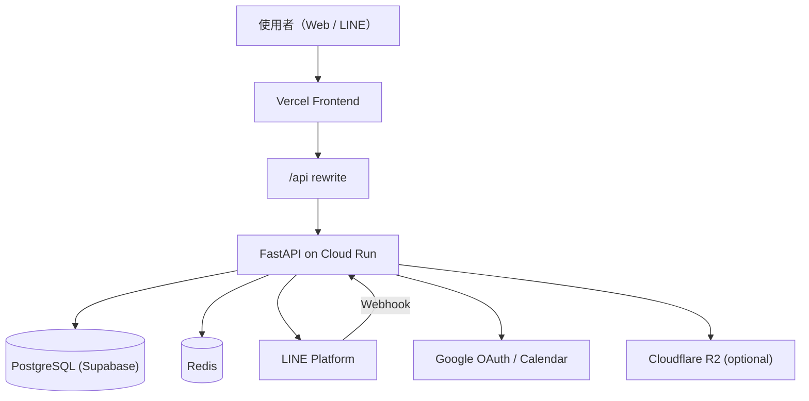

# Cale's Breathe v2 — 面試展示 README

> 一個可實際上線的小型預約系統：以 FastAPI 為核心，整合 LINE/Google OAuth、預約規則引擎、Google Calendar 同步，並具備 Docker 本機整合流程與 CI/CD 自動部署能力。

---

## 🚀 Cale's Breathe v2


### 專案解決的問題

此專案解決「個人工作室預約流程分散、容易衝突、取消規則難落地」的問題，提供：

- 統一的預約 API（建立、查詢、取消）
- 明確商業規則（同時段衝突檢查、開約前 24 小時不可取消）
- 第三方整合（LINE、Google OAuth、Google Calendar）
- 可展示的完整工程流程（本機 Docker、測試、CI/CD、雲端部署）

---

## 🛠 技術棧 (Tech Stack)

### 前端

- React
- Vite
- JavaScript (ES6+)
- React Router（SPA 路由）

### 後端

- Python 3
- FastAPI
- SQLAlchemy 2.x
- Uvicorn

### 資料庫 / 快取

- PostgreSQL（正式環境：Supabase；本機整合：Docker Compose Postgres）
- SQLite（本機快速開發 fallback）
- Redis（登入限流 Token Bucket）
- Upstash Redis（雲端 Redis 服務，支援無伺服器環境）

### 部署 / 工具

- Docker / Docker Compose
- NGINX Gateway（本機整合）
- GitHub Actions（CI + CD）
- Google Cloud Run（後端）
- Vercel（前端）
- Supabase（託管 PostgreSQL）
- Alembic（資料庫 migration）

### 第三方整合

- LINE Messaging API（Webhook）
- LINE Login（OAuth）
- Google OAuth
- Google Calendar API
- Supabase（PostgreSQL 託管服務）
- Upstash Redis（Rate Limit / 快取）
- Cloudflare R2（檔案儲存，可選）

---

## 🌟 核心功能 (Key Features)

- **預約建立與查詢**：支援服務組合、日期查詢、單筆查詢。
- **前後端同網域整合**：前端透過 `/api` rewrite 對接後端，降低 Cookie / OAuth 跨網域問題。
- **預約衝突檢查**：若時段重疊，回應 `409 Conflict`，避免雙重預約。
- **取消規則落地**：開約前 24 小時內不可取消，確保營運規則可被系統強制執行。
- **OAuth 與 Session 安全設計**：Google / LINE 登入，採 HttpOnly Cookie（access + refresh）策略。
- **LINE Webhook**：驗簽 + 事件冪等處理，避免重送造成重複操作。
- **Google Calendar 同步**：預約建立 / 取消時同步外部行事曆，提升行程管理一致性。
- **登入限流**：以 Redis Token Bucket 降低暴力登入風險。
- **資料庫版本控管**：使用 Alembic 管理 schema migration，讓本機、CI、雲端環境一致。

---

## 📐 系統架構 (Architecture)



### 資料流說明

1. 使用者從 Web 或 LINE 發起操作（登入、建立預約、取消預約）。
2. API 層先做身分驗證與授權，再進入預約規則檢查（衝突、取消時窗、角色權限）。
3. 規則通過後寫入 PostgreSQL，並同步外部系統（Google Calendar / LINE 通知）。
4. 安全與穩定性輔助由 Redis（限流）與冪等策略支撐。

### 設計思維（面試可講）

- **分層責任清楚**：Router -> Service -> Repository/DB，降低耦合、方便測試。
- **可演進架構**：先以可交付 MVP 為主，再逐步強化（衝突查詢優化、補償機制、排程提醒）。

---

## 🔧 本地開發環境設置 (Getting Started)

### 1) Clone Repo

```bash
git clone <YOUR_REPO_URL>
cd cales-breathe-v2
```

### 2) 環境變數

- 複製 `cales-breathe-v2-api/.env.example` 為 `cales-breathe-v2-api/.env`
- 至少確認以下關鍵值：
  - `FRONTEND_PUBLIC_ORIGIN`
  - `API_PUBLIC_BASE_URL`
  - `JWT_SECRET`
  - `DATABASE_URL`（本機直跑可用 SQLite；Docker 會覆寫為 Postgres）
  - `LINE_CHANNEL_SECRET` / `LINE_CHANNEL_ACCESS_TOKEN`（若要測 webhook）
  - `GOOGLE_OAUTH_CLIENT_ID` / `GOOGLE_OAUTH_CLIENT_SECRET`（若要測 OAuth）

### 3) Docker 啟動（建議）

```bash
docker compose up --build -d
```

### 4) 執行資料庫 Migration（Alembic）

```bash
cd cales-breathe-v2-api
alembic upgrade head
```

### 5) 驗證

- App: `http://localhost`
- API Health: `http://localhost/api/health`
- Swagger: `http://localhost/api/docs`（依環境設定可能受保護或關閉）

---

## 📈 困難與挑戰 (Challenges & Solutions)

### 挑戰 1：預約衝突與一致性

- **問題**：多人同時操作時，容易出現重複預約與時間重疊。
- **對策**：導入時段重疊檢查規則（`new_start < existing_end && existing_start < new_end`），衝突即回 `409`。
- **結果**：在 API 層即擋下衝突請求，確保預約資料一致性。

### 挑戰 2：取消政策落地

- **問題**：人工流程很難穩定執行「24 小時內不可取消」規範。
- **對策**：將政策內建於取消 API，違規直接回 `400`，並補測試覆蓋邊界。
- **結果**：商業規則可被系統化執行，避免前後台認知不一致。

### 挑戰 3：第三方整合失敗風險

- **問題**：LINE/Google API 偶發失敗可能造成外部狀態不同步。
- **對策**：實作驗簽、冪等與錯誤紀錄，並保留補償流程設計空間。
- **結果**：在面試可清楚說明「一致性 vs. 複雜度」的 trade-off 與演進路徑。

---

## 🔗 API 文件與 Demo

### API Docs

- 本機 Swagger：`http://localhost/api/docs`
- 產品環境（若已開放）：`<YOUR_PROD_API_URL>/docs`

### Demo

- 前端 Demo：`<YOUR_VERCEL_URL>`
- 後端 API：`<YOUR_CLOUD_RUN_URL>`
- LINE Bot（QR Code / 操作影片）：`<YOUR_DEMO_LINK>`

> 面試建議：準備 3 分鐘 Demo 流程（登入 -> 建立預約 -> 查詢 -> 取消限制觸發），可完整展示你的系統設計與後端思維。

---

## 面試加分講法（可直接口述）

- 我不只寫 CRUD，而是把真實商業規則（衝突、取消時窗、權限）轉成可驗證的 API 契約。
- 我把系統做成可部署、可測試、可維運：本機 Docker 一鍵啟動、GitHub Actions 自動驗證與部署。
- 我有考慮第三方整合的一致性問題，並設計冪等與後續補償策略，兼顧交付速度與可演進性。
