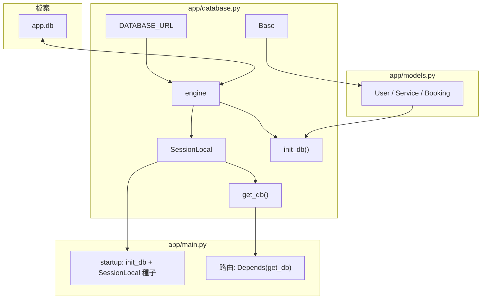

# SQLAlchemy 資料庫設定筆記

對應專案檔案：`app/database.py`  
相關檔案：`app/models.py`（ORM 模型繼承 `Base`）、`app/main.py`（`get_db` / `init_db` / `SessionLocal`）

---

## 1. 四個核心名詞（一句話）

| 名詞 | 一句話 |
|------|--------|
| `DATABASE_URL` | 告訴程式「資料庫在哪」的**連線字串**（本專案為本機檔案 `./app.db`）。 |
| `engine` | 與該 URL 對應資料庫之間的**連線引擎**；執行 SQL、`create_all` 都經過它。 |
| `SessionLocal` | 產生 **Session**（一次操作／一輪交易用的工作階段）的**工廠**。 |
| `Base` | ORM 模型繼承的**宣告基底**；所有繼承它的類別會登錄到 metadata，供建表使用。 |

**實際順序**：`DATABASE_URL` → 建 `engine` → 模型繼承 `Base` → `init_db` 建表 → 執行期用 `SessionLocal()` 或 `get_db()` 取得 Session 做查詢／寫入。

---

## 2. `DATABASE_URL`

本專案：

```text
sqlite:///./app.db
```

- **SQLite**：單一檔案資料庫，無需另外安裝伺服器。
- **`./app.db`**：專案目錄下的 `app.db` 檔案。

若日後改 PostgreSQL 等，通常改此字串與 `connect_args` 即可，其餘 Session／`Base` 概念仍可沿用。

---

## 3. `engine`

```python
engine = create_engine(
    DATABASE_URL,
    connect_args={"check_same_thread": False},  # SQLite 需要
)
```

- **用途**：建立與資料庫的連線池／連線介面；`Base.metadata.create_all(bind=engine)` 也綁在這裡。
- **`check_same_thread=False`**：SQLite 預設限制「建立連線的執行緒」才能用；FastAPI 多 worker／多請求時需關閉此限制，否則容易出錯。

---

## 4. `SessionLocal`

```python
SessionLocal = sessionmaker(autocommit=False, autoflush=False, bind=engine)
```

- **`sessionmaker(...)`**：回傳一個「可呼叫」的工廠；每次 `SessionLocal()` 得到一個新的 **Session**。
- **`autocommit=False`**：需自行 `commit()`／`rollback()`，行為較直觀、利於交易控制。
- **`autoflush=False`**：不會在每次查詢前自動 flush；需要時可手動 `flush()`（本專案多數情境直接 `commit()` 即可）。

**Session 能做什麼**：`query`、`add`、`delete`、`commit`、`rollback`、`close` 等，代表「這一輪對資料庫的操作」。

---

## 5. `Base`

```python
Base = declarative_base()
```

- 在 `models.py` 裡：`class User(Base)` 這類寫法會把表結構註冊到 **`Base.metadata`**。
- `init_db()` 裡的 `Base.metadata.create_all(bind=engine)` 會依 metadata **建立尚未存在的資料表**。

---

## 6. `get_db()`（FastAPI 依賴注入）

```python
def get_db():
    db = SessionLocal()
    try:
        yield db
    finally:
        db.close()
```

- **用途**：路由參數寫 `db: Session = Depends(get_db)` 時，每個 HTTP 請求會取得**一個** Session，請求結束後 **一定** `close()`，避免連線外洩。
- **`yield`**：讓 FastAPI 在處理完該請求後執行 `finally`，與同步生成器依賴的常見寫法一致。

---

## 7. `init_db()`（啟動時建表）

```python
def init_db():
    from app.models import User, Service, Booking  # noqa: F401
    Base.metadata.create_all(bind=engine)
```

- **為何要先 import 模型**：確保 `User`、`Service`、`Booking` 已載入並註冊到 `Base.metadata`；若未 import，metadata 可能不完整，`create_all` 不會建出那些表。
- **`create_all`**：只會**建立不存在的表**，不會自動做欄位遷移（改欄位需自行遷移工具或手動處理）。

---

## 8. 在 `main.py` 中的兩種用法

1. **啟動事件**（`startup`）：呼叫 `init_db()` 後，用 **`SessionLocal()`** 直接開一個 Session 寫入種子資料，最後在 `finally` 裡 `db.close()`。
2. **一般路由**：使用 **`Depends(get_db)`** 注入 Session，不在路由裡手動 `SessionLocal()`。

兩者差異：啟動階段沒有「單一 HTTP 請求」生命週期，故手動建立／關閉 Session；一般 API 則交給 `get_db` 管理。

---

## 9. 架構關係圖



**精簡一維依賴**：

```text
DATABASE_URL → engine → SessionLocal → Session（查詢／寫入）
                 ↑
models 繼承 Base → metadata → init_db() → create_all
```

---

## 10. 與 Pydantic `schemas` 的區別（複習）

| 層級 | 角色 |
|------|------|
| `database.py` + `models.py` | 持久化：表結構、ORM、Session。 |
| `schemas.py` | API 進出：請求／回應的欄位與驗證，不直接等於資料表。 |

路由中常見流程：用 Pydantic 驗證 body → 用 Session 操作 ORM 模型 → 用 Pydantic `response_model` 輸出。
