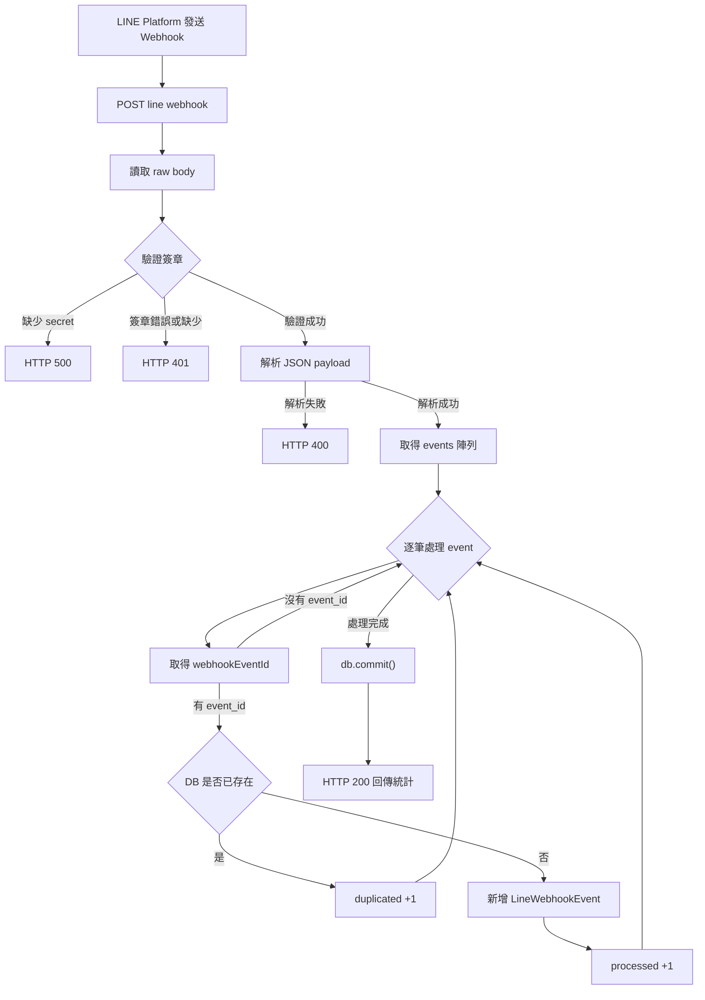

# line_webhook_events 筆記

## 範圍

- `app/models.py` 的 `LineWebhookEvent`（資料表）
- `app/main.py` 的 `POST /line/webhook`（Webhook 入口）

---

## 1) `LineWebhookEvent` 資料表在做什麼

`LineWebhookEvent` 是用來記錄「LINE 每次送來的事件 ID」的表，核心目的是 **冪等（idempotency）**，避免重送造成重複處理。

- `id`：主鍵（系統內部識別）
- `event_id`：LINE 事件唯一鍵（`unique=True`）
- `created_at`：寫入時間（方便追蹤）

重點：
- `event_id` 設成 `unique + index + not null`，代表同一個事件只能成功寫入一次。
- 只要事件曾寫入過，就能判定它是重複事件。

---

## 2) `/line/webhook` 流程拆解

### A. 收到請求後先拿 raw body

```python
raw_body = await request.body()
```

目的是用「原始 bytes」做簽章驗證，避免 JSON 重新序列化造成內容差異。

### B. 驗證 `X-Line-Signature`

```python
_verify_line_signature(raw_body, x_line_signature)
```

驗證重點：
- 從環境變數讀 `LINE_CHANNEL_SECRET`
- 用 `HMAC-SHA256(secret, raw_body)` 算簽章
- Base64 編碼後和 header 比對
- 比對失敗回 `401`

### C. parse JSON payload

```python
payload = json.loads(raw_body.decode("utf-8"))
```

若 payload 不是合法 JSON，回 `400 LINE payload 格式錯誤`。

### D. 逐筆處理 events 並做去重

程式對 `payload["events"]` 迴圈：

1. 取 `webhookEventId`
2. 沒有 `event_id` 就 `continue`
3. 查 DB 是否已存在
4. 存在：`duplicated += 1`
5. 不存在：寫入 `LineWebhookEvent(event_id=...)`，`processed += 1`

最後 `db.commit()` 一次提交，回傳：

```json
{"status":"ok","processed":X,"duplicated":Y}
```

---

## 3) 這段設計的價值

- **安全性**：先驗簽，拒絕偽造來源。
- **穩定性**：LINE 重試或網路抖動時，不會重複處理同事件。
- **可觀測性**：`processed / duplicated` 可快速看出當次請求品質。

---

## 4) 目前實作的限制與注意

1. 目前只做「記錄事件 + 去重」，尚未把每個事件導向實際業務邏輯（例如建立預約、回訊息）。
2. 去重流程目前是「先查再插入」，高併發下理論上可能發生競態（兩請求同時查無後同時插入）。
3. 若之後流量提高，建議改為「直接插入，靠 DB unique 擋重複，再捕捉 `IntegrityError`」會更穩。
4. `events` 若缺欄位目前是略過，不會拋錯；這是寬容策略，實務上可加 log 方便追蹤。

---

## 5) 面試可用 30 秒說法

「我在 webhook 入口先做 LINE 簽章驗證，確保請求來源正確；通過後才 parse payload。每筆 event 用 `webhookEventId` 寫入 `line_webhook_events` 做冪等，已存在就標記 duplicated，不重複執行後續流程。這樣可以防 LINE 重送造成重複建單，並且回傳 processed/duplicated 方便觀測。」  

---

## 6) 流程圖筆記（Mermaid）



補充：
- 這張圖是目前「驗簽 + 冪等記錄」版本，不含後續業務動作（例如回覆訊息、建立預約）。
- 未來可在 `L[新增 LineWebhookEvent]` 之後串接「事件分流處理」節點。 

---

## 7) 專案實作 vs LINE 官方規範（對照表）

> 參考官方：
> - Webhook 接收：[Receiving messages (webhook)](https://developers.line.biz/en/docs/messaging-api/receiving-messages/)
> - 驗簽機制：[Verify webhook signature](https://developers.line.biz/en/docs/messaging-api/verify-webhook-signature/)

| 面向 | LINE 官方建議 | 目前專案實作 | 差距判斷 |
| --- | --- | --- | --- |
| Webhook 路徑 | 提供可被 LINE 呼叫的 HTTPS endpoint | `POST /line/webhook` | ✅ 已符合（部署時需公開 HTTPS） |
| 驗證 header | 讀取 `X-Line-Signature` | 以 `x_line_signature` 讀取 | ✅ 已符合 |
| 驗簽方式 | 用 Channel secret 對 raw request body 做 HMAC-SHA256，Base64 比對 | `_verify_line_signature(raw_body, signature)` 完整實作 | ✅ 已符合 |
| 驗簽時機 | 先驗簽，再做 payload 處理 | 先 `request.body()`，立刻驗簽，成功才 `json.loads` | ✅ 已符合 |
| 回應狀態碼 | 正常處理建議回 2xx，避免 LINE 持續重送 | 正常回 `200` + 統計資訊 | ✅ 已符合 |
| 重送/重複事件處理 | 官方文件提到可能重送，需做冪等設計 | 用 `line_webhook_events.event_id (unique)` 去重 | ✅ 已符合（MVP 良好） |
| 事件資料完整性 | `events` 可能為空或有不同 event type，需容錯 | `payload.get("events", [])`，缺 `webhookEventId` 則略過 | ✅ 基本符合 |
| 事件分流處理 | 依 event type（message/follow/unfollow...）做對應業務 | 目前只做「驗簽 + 去重記錄」，未分流 | ⚠️ 下一步需補 |
| 錯誤處理策略 | 避免未捕捉例外造成 5xx（會觸發重送） | 已處理簽章錯誤與 JSON 格式錯誤；業務例外策略尚未完整 | ⚠️ 可再強化 |
| 安全設定 | Channel secret 必須安全保存（環境變數） | 使用 `LINE_CHANNEL_SECRET` 環境變數 | ✅ 已符合 |
| 可觀測性 | 建議可追蹤每次 webhook 結果 | 回傳 `processed/duplicated`，但 log 尚可加強 | ⚠️ 建議補 log/request id |
| 高併發一致性 | 去重應避免 race condition | 目前為「先查再插入」模式 | ⚠️ 建議改為「直接插入 + 捕捉 unique 衝突」 |

### 面試可直接講的結論

目前 webhook 的「安全驗簽、基本容錯、冪等去重」已對齊官方核心要求，屬於可上線 MVP 基礎。下一步重點是補齊「事件分流處理（message/follow 等）、高併發下的去重一致性、與完整 observability（結構化 log / request id）」三件事。  
