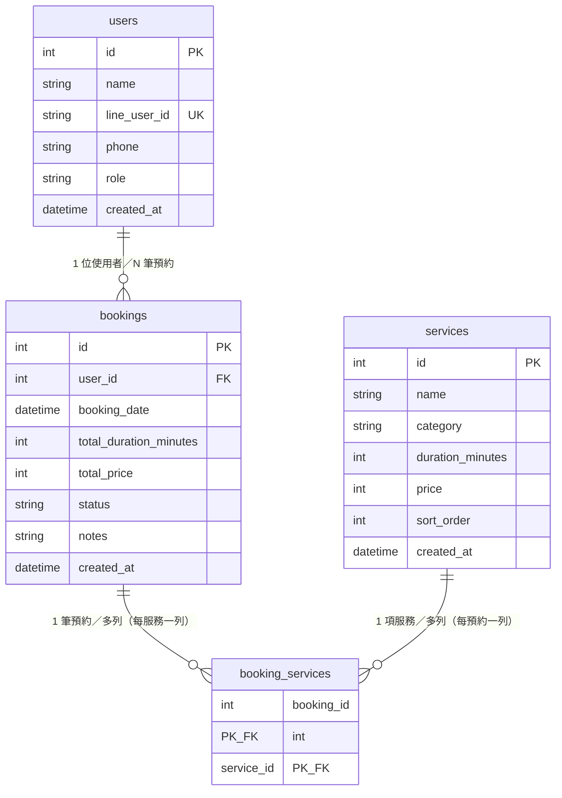
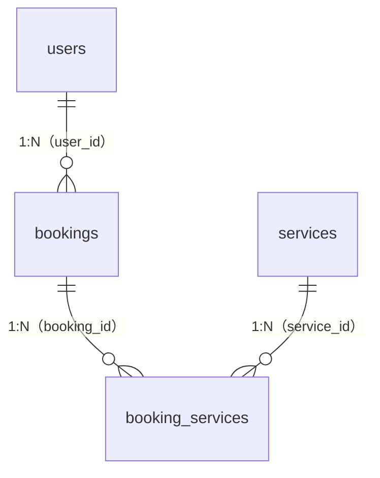
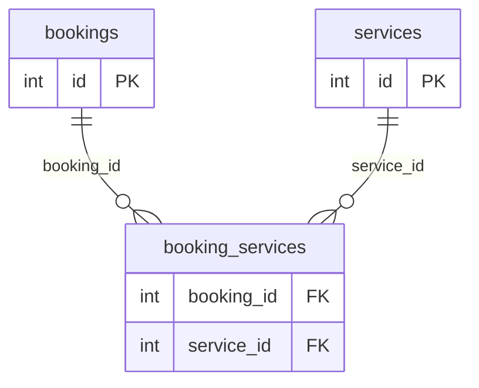
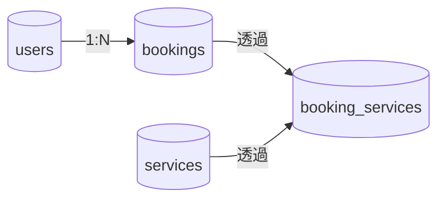

# SQLAlchemy Models 重點筆記

對應專案檔案：`app/models.py`  
相關檔案：`app/database.py`（`Base`）、`app/schemas.py`（對外契約，與 ORM 分離）

---

## 1. 整體結構（一句話）

| 項目 | 說明 |
|------|------|
| `Base` | 所有 ORM 類別繼承自此，表結構登錄到 metadata，供 `create_all` 建表。 |
| `User` / `Service` / `Booking` | 三張**主表**，對應 `users`、`services`、`bookings`。 |
| `booking_services` | **關聯表**（`Table`，非 `class`），表達 **Booking ↔ Service** 的**多對多**。 |

**關係摘要**：

- **User 1 — N Booking**：`bookings.user_id` → `users.id`。
- **Booking M — N Service**：透過 `booking_services`（`booking_id`、`service_id` 複合主鍵）。

---

## 2. `booking_services`（多對多中介表）

```python
booking_services = Table(
    "booking_services",
    Base.metadata,
    Column("booking_id", Integer, ForeignKey("bookings.id"), primary_key=True),
    Column("service_id", Integer, ForeignKey("services.id"), primary_key=True),
)
```

**重點**：

- 使用 **`Table`** 而非 `declarative` 類別時，常見於「純關聯、無額外欄位」的中介表。
- 兩欄皆 **`primary_key=True`** → 資料庫層為**複合主鍵**，同一組 `(booking_id, service_id)` 不會重複。
- **兩端** `Booking` 與 `Service` 的 `relationship` 都需指定 **`secondary=booking_services`**，並 **`back_populates`** 互相對應。

---

## 3. 各 Model 欄位速查

### `User` → `users`

| 欄位 | 說明 |
|------|------|
| `id` | PK，`index=True` |
| `name` | 必填，最長 100 |
| `line_user_id` | 可空，`unique=True`，`index=True` |
| `phone` | 可空，最長 20 |
| `role` | 預設 `"customer"`；註解：`customer \| owner` |
| `created_at` | 預設 `datetime.utcnow` |

**關聯**：`bookings = relationship("Booking", back_populates="user")` → 一使用者多筆預約。

### `Service` → `services`

| 欄位 | 說明 |
|------|------|
| `id` | PK，`index=True` |
| `name` | 必填 |
| `category` | 必填，`index=True` |
| `duration_minutes` | 預設 60 |
| `price` | 預設 0 |
| `sort_order` | 預設 0 |
| `created_at` | 預設 `datetime.utcnow` |

**關聯**：`bookings` 經 **`secondary=booking_services`** 連到 `Booking`。

### `Booking` → `bookings`

| 欄位 | 說明 |
|------|------|
| `id` | PK，`index=True` |
| `user_id` | FK → `users.id`，**必填** |
| `booking_date` | 預約時間，必填 |
| `total_duration_minutes` / `total_price` | 必填（整數） |
| `status` | 預設 `"confirmed"`；註解：`confirmed \| cancelled \| completed` |
| `notes` | 可空，最長 500 |
| `created_at` | 預設 `datetime.utcnow` |

**關聯**：`user` ↔ `User`；`services` ↔ `Service`（多對多）。

---

## 4. `relationship` 與 `back_populates`

| 在一端寫 | 在另一端寫 | 語意 |
|----------|-------------|------|
| `User.bookings` | `Booking.user` | 一對多／多對一，**名稱不同**故用 `back_populates` 成對字串。 |
| `Booking.services` | `Service.bookings` | 多對多，**同樣** `back_populates`，且兩邊都要加 **`secondary=booking_services`**。 |

**為何要 `back_populates`**：雙向導覽一致——從使用者找預約、從預約找使用者；從預約找服務列表、從服務找預約列表，ORM 會維護同一組關聯。

---

## 5. ER Diagram（Mermaid）

Mermaid `erDiagram` 中常見線段：**`||`** 表示「恰好一側」、**`o{`** 表示「零到多」、**`|{`** 表示「一到多」。以下表名與 `models.py` 的 `__tablename__`／`Table("…")` 一致。

### 5.1 完整版（含欄位與中介表 `booking_services`）



### 5.2 精簡版（不畫欄位，以三段 1:N 表達 M:N）



> 註：語意上「一筆預約 ↔ 多項服務」是 **M:N**，在資料庫中拆成 **兩個 1:N** 指向 **`booking_services`**，與 `models.py` 一致。

### 5.3 僅中介表與 FK 方向（對齊資料庫）



### 5.4 流程圖輔助（非 ER 標準，方便記 1:N 與 M:N）



---

## 6. 與 `schemas.py` 的分工

- **`models.py`**：資料庫**持久化**結構（表、FK、索引、關聯）。
- **`schemas.py`**：API **輸入／輸出** 與驗證；讀取時用 Pydantic `from_attributes` 從 ORM 轉成 JSON 友善的型別。

修改欄位時通常兩邊都要對齊（或刻意在 schema 隱藏部分欄位）。

---

## 參考

- SQLAlchemy ORM：`relationship`、`Table`、`ForeignKey`
- 官方文件：<https://docs.sqlalchemy.org/en/20/orm/>
