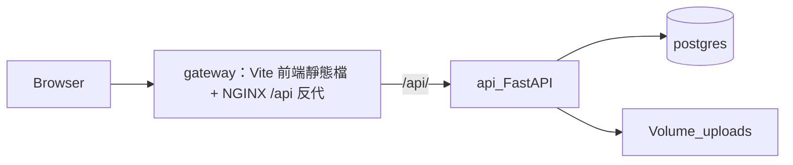

# cales-breathe-v2 Docker 開發計畫

> **總覽**：本機與雲端部署對照請先讀 [`本地與雲端部署.md`](本地與雲端部署.md)。

本文件描述 monorepo 內以 **Docker Compose** 進行**本機整合測試**之主線。正式環境為 **Vercel ＋ Cloud Run ＋ Supabase**（見 [`本地與雲端部署.md`](本地與雲端部署.md)）；曾規劃以 **GCP VM** 承載與 compose 類似之單機架構，**已取消**。實作細節以 [`README-legacy-root.md`](README-legacy-root.md)、[`docker-compose.yml`](../docker-compose.yml) 為準（根目錄 [`README.md`](../README.md) 為面試總覽）。

---

## 1. 目標

| 階段 | 目標 |
|------|------|
| **A. 本機 Docker** | 單一指令啟動 **Postgres、FastAPI、`cales-breathe-v2-vite` 前端（Vite 產物）、NGINX 閘道**；閘道於 `/` 提供 SPA、`/api/` 反代至後端，瀏覽器可驗證主要流程。 |
| **B. 本機 OAuth／Bot** | Google／LINE Login 以登記之 callback 測通；LINE Messaging Webhook 以 **HTTPS 隧道**（如 ngrok）測通。 |
| **C. 正式佈署** | **已採用** Vercel（前端）＋ Cloud Run（API）＋ Supabase（DB），見 [`本地與雲端部署.md`](本地與雲端部署.md)。**未採用** 將 compose 整包遷至 GCP VM 之路線。 |

---

## 2. 架構概要



`gateway` 映像於建置階段編譯 [`cales-breathe-v2-vite`](../cales-breathe-v2-vite)，將 `dist` 置於 NGINX `root`，故 **Docker Compose 已涵蓋前端**（無須另開 `npm run dev` 容器即可用瀏覽器驗證整站）。

### Compose 服務一覽

| 服務 | 說明 |
|------|------|
| **postgres** | PostgreSQL 16 |
| **api** | FastAPI（[`cales-breathe-v2-api/Dockerfile`](../cales-breathe-v2-api/Dockerfile)） |
| **gateway** | 多階段映像（[`deploy/Dockerfile`](../deploy/Dockerfile)）：**Node 建置 Vite** → **NGINX** 服務靜態檔 + [`deploy/nginx.conf`](../deploy/nginx.conf) 之 `/api/` 反代 |

- **api**：`DATABASE_URL` 由 Compose 覆寫為連 **postgres** 服務。
- **postgres**：資料持久化於 named volume `postgres_data`；上傳檔於 `api_uploads`。

---

## 3. 前置條件

- 已安裝並啟動 **Docker Desktop**（或相容的 Docker Engine + Compose plugin）。
- `cales-breathe-v2-api/.env` 已自 `.env.example` 建立，且**未**提交版本庫。
- （選用）根目錄 `.env`：自 [`.env.example`](../.env.example) 複製，用於 `POSTGRES_*`、`VITE_API_BASE`、`GATEWAY_HTTP_PORT`。

---

## 4. 本機 Docker 工作流程

### 4.1 首次或變更依賴後

```bash
cd cales-breathe-v2
docker compose up --build -d
```

### 4.2 僅變更後端程式

```bash
docker compose up -d --build api
```

### 4.3 變更前端或 `VITE_*` 建置參數

修改根目錄 `.env` 內 `VITE_API_BASE` / `VITE_LINE_ADD_FRIEND_URL` 後：

```bash
docker compose build gateway --no-cache
docker compose up -d gateway
```

### 4.4 經由 gateway 瀏覽時的環境變數（`cales-breathe-v2-api/.env`）

與「同網域」一致，例如 gateway 為 `http://localhost`：

- `FRONTEND_PUBLIC_ORIGIN=http://localhost`
- `API_PUBLIC_BASE_URL=http://localhost/api`
- 本機 HTTP：`COOKIE_SECURE=false`、`COOKIE_SAMESITE=lax`

若 `GATEWAY_HTTP_PORT=8080`，上述改為 `http://localhost:8080` 與 `http://localhost:8080/api`，並同步 `VITE_API_BASE`。

### 4.5 常用維運指令

| 指令 | 用途 |
|------|------|
| `docker compose ps` | 服務狀態 |
| `docker compose logs -f api` | 後端日誌 |
| `docker compose logs -f gateway` | 閘道日誌 |
| `docker stats` | 容器資源（小機器除錯時） |

---

## 5. 與「非 Docker」本機開發並存

- **前端**：`cales-breathe-v2-vite` 內 `npm run dev`（預設埠 3000）。
- **後端**：`uvicorn app.main:app --reload`（預設埠 8000）。

此時 `VITE_API_BASE`、`FRONTEND_PUBLIC_ORIGIN`、`API_PUBLIC_BASE_URL` 應指向對應埠，與 Docker gateway 模式**分開設定**；切換模式時請核对 OAuth 後台登記之 URL。

---

## 6. Google／LINE 與 LINE Bot

### 6.1 Login（本機 browser）

Redirect／Callback 須與 `API_PUBLIC_BASE_URL` 完全一致，例如：

- `{API_PUBLIC_BASE_URL}/auth/google/callback`
- `{API_PUBLIC_BASE_URL}/auth/line/callback`

避免混用 `localhost` 與 `127.0.0.1`、或漏／多斜線。

### 6.2 Messaging API Webhook

LINE 需 **HTTPS 公網**；本機請使用 **ngrok**、**Cloudflare Tunnel** 等，Webhook 路徑為：

`/api/line/webhook`（對外完整 URL 為 `https://<隧道>/api/line/webhook`）。

---

## 7. Git 分支建議

- 主線：`main`（可隨時本機／Docker 驗證通過之狀態）。
- Docker 相關開發：`feature/docker-local` 或 `chore/docker-compose`（依團隊習慣擇一）。

大規模搬目錄或僅調整 compose 時，建議**獨立 commit**，便於回溯。

---

## 8. 歷史備考：GCP VM 方案（已取消）

> **現況**：正式環境改採 **Cloud Run + Vercel + Supabase**，不再以單一 GCP VM 跑 compose。

以下為當初評估 VM 時之備忘（僅供對照，**非目前路線**）：

- VM 安裝 Docker 與 Compose；上傳 monorepo 或部署產物。
- 防火牆開放 80／443；網域 DNS 指向 VM；憑證（如 Let’s Encrypt）。
- 正式環境：`COOKIE_SECURE=true`、正確之 `FRONTEND_PUBLIC_ORIGIN` / `API_PUBLIC_BASE_URL`。
- **e2-micro（1 GB）**：可當實驗；同機跑 Postgres 建議預留 **swap** 或升級機型；資源限制與 Postgres `max_connections` 須與後端連線池一併檢視。

---

## 9. 檢查清單（上線前）

- [ ] 根目錄與 `api` 之 `.env` 未提交版本庫。
- [ ] `docker compose up` 後 `/api/health` 可連線，且 **gateway 根路徑 `/`** 可載入 Vite 前端（非僅 API）。
- [ ] 上傳／圖片（若 `STORAGE_BACKEND=local`）寫入 volume，重建容器後仍存在。
- [ ] OAuth／LINE／Webhook 後台 URL 與執行環境一致。
- [ ] 正式環境已規劃 Postgres 與 `uploads` 備份策略。

---

## 10. 相關檔案索引

| 路徑 | 說明 |
|------|------|
| [`../docker-compose.yml`](../docker-compose.yml) | 服務定義（**gateway = 前端建置 + NGINX**） |
| [`../deploy/Dockerfile`](../deploy/Dockerfile) | Vite 建置與 NGINX 映像 |
| [`../deploy/nginx.conf`](../deploy/nginx.conf) | 閘道路由 |
| [`../cales-breathe-v2-vite/`](../cales-breathe-v2-vite/) | 前端原始碼（由 `deploy/Dockerfile` 納入建置） |
| [`../.env.example`](../.env.example) | Compose／建置變數範例 |
| [`cales-breathe-v2-api/.env.example`](../cales-breathe-v2-api/.env.example) | 後端完整變數範例 |

---

*文件版本：依目前 repo 結構撰寫；若目錄或服務名稱變更，請同步更新本頁與 README。*
