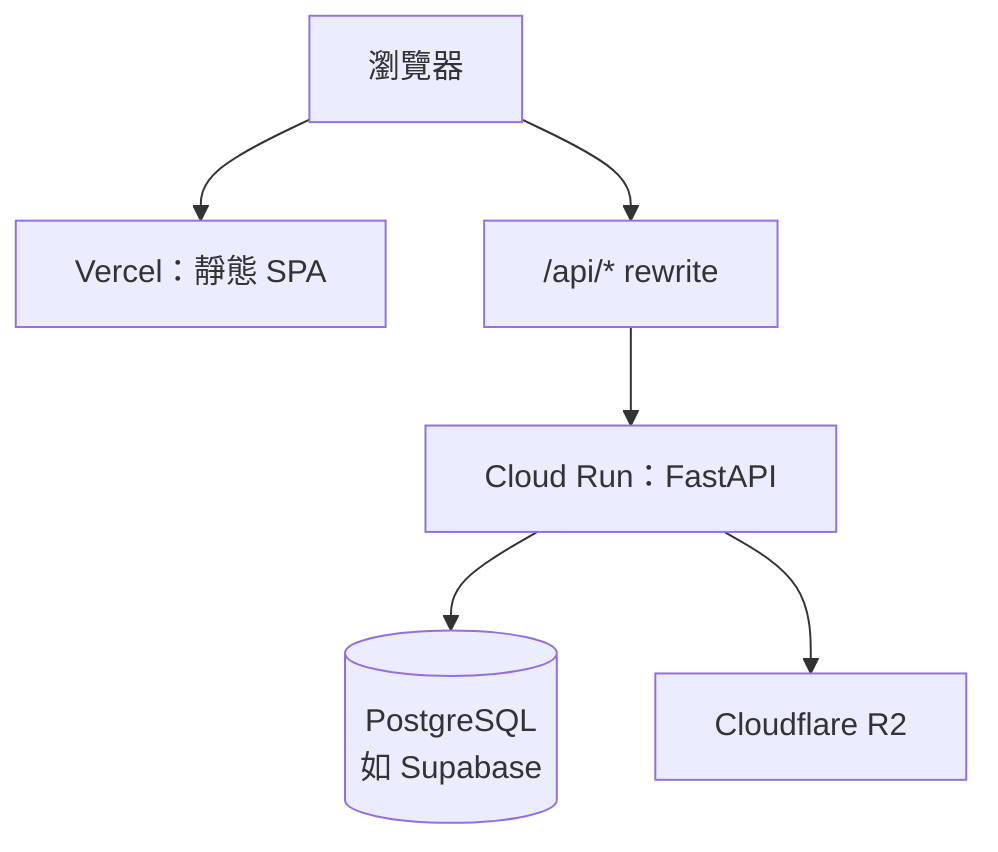
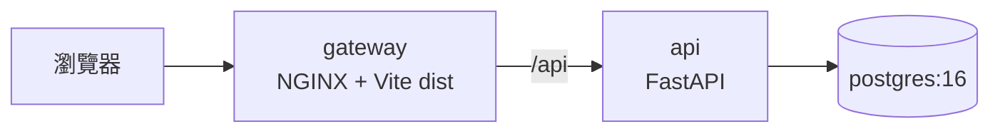

# 本機與雲端部署總覽

本文件整理 **cales-breathe-v2** 的部署方式：本機以 Docker Compose 為主線，雲端以 **Vercel（前端）＋ Google Cloud Run（後端 API）＋ Supabase（PostgreSQL）** 為目前正式環境主線；細節仍以下列深讀文件為準。

| 情境 | 主要入口 |
|------|----------|
| 本機整合（Postgres + API + 前端靜態 + NGINX） | 根目錄總覽 [`README.md`](../README.md)；操作細節 [`README-legacy-root.md`](README-legacy-root.md)、[`DOCKER_DEVELOPMENT_PLAN.md`](DOCKER_DEVELOPMENT_PLAN.md) |
| 雲端（Cloud Run、Vercel、gcloud 流程） | [`docs/cloud run筆記.md`](cloud%20run筆記.md) |
| 歷史／待辦／環境變數長表（含曾用 Render 敘述） | [`cales-breathe-v2-api/docs/DEPLOYMENT_STATUS.md`](../cales-breathe-v2-api/docs/DEPLOYMENT_STATUS.md) |

---

## 架構對照

### 雲端（與目前 `vercel.json` 一致）



- 前端建置專案：[`cales-breathe-v2-vite`](../cales-breathe-v2-vite/)。
- 瀏覽器端 API 基底網址應指向前端網域下的 **`/api`**（與 Cookie／OAuth callback 同網域策略一致）。
- Repository 內 [`cales-breathe-v2-vite/vercel.json`](../cales-breathe-v2-vite/vercel.json) 將 `/api/:path*` 轉發至 Cloud Run；若更換後端網址，**必須**同步更新該檔並重新部署 Vercel。

### 本機：Docker Compose



- 定義檔：根目錄 [`docker-compose.yml`](../docker-compose.yml)。
- `gateway` 由 [`deploy/Dockerfile`](../deploy/Dockerfile) 建置，[`deploy/nginx.conf`](../deploy/nginx.conf) 設定 `/api` 反代。

### 可選：Render Blueprint

[`cales-breathe-v2-api/render.yaml`](../cales-breathe-v2-api/render.yaml) 描述以 Render 託管 Web Service 與 Render PostgreSQL 的範例；若未使用 Render，可僅作參考。與「Vercel → Cloud Run」路線並存時，請避免混淆實際上線的 API 公開網址。

---

## 本機部署精簡步驟

1. **前置**：安裝 Docker；自 [`cales-breathe-v2-api/.env.example`](../cales-breathe-v2-api/.env.example) 建立 `cales-breathe-v2-api/.env`（勿提交）。可選：根目錄自 [`.env.example`](../.env.example) 建立 `.env`，調整 `POSTGRES_*`、`VITE_API_BASE`、`GATEWAY_HTTP_PORT`。
2. **同網域設定**（gateway 為 `http://localhost` 時）：`FRONTEND_PUBLIC_ORIGIN=http://localhost`、`API_PUBLIC_BASE_URL=http://localhost/api`；本機 HTTP 建議 `COOKIE_SECURE=false`、`COOKIE_SAMESITE=lax`。
3. **啟動**：

   ```bash
   cd cales-breathe-v2
   docker compose up --build -d
   ```

4. **驗證**：瀏覽器開 `http://localhost`（或依 `GATEWAY_HTTP_PORT`）；`http://localhost/api/health`。

重建前端閘道（變更 `VITE_*` 建置參數後）：

```bash
docker compose build gateway --no-cache
docker compose up -d gateway
```

**不跑 Docker 時**：前端 `npm run dev`、後端 `uvicorn --reload`；`VITE_API_BASE` 與 OAuth callback 須改對應埠，且與各開發者後台登記 URL 一致。詳見 [`DOCKER_DEVELOPMENT_PLAN.md`](DOCKER_DEVELOPMENT_PLAN.md) 第 5、6 節。

---

## 雲端部署精簡步驟

1. **後端映像**：以 `cales-breathe-v2-api` 目錄建置並部署至 Cloud Run（專案、Region、Artifact Registry、環境變數）。**日常指令與排查**見 [`cloud run筆記.md`](cloud%20run筆記.md)。
2. **前端**：Vercel 連結 `cales-breathe-v2-vite`；`vercel.json` 的 `/api/*` destination 須指向目前 Cloud Run 服務 URL。
3. **環境變數（後端）**：至少包含 `DATABASE_URL`、`JWT_SECRET`、`COOKIE_SECURE=true`、`COOKIE_SAMESITE=none`、`FRONTEND_PUBLIC_ORIGIN`、`API_PUBLIC_BASE_URL`（通常為 `https://<前端網域>/api`）、LINE／Google 等 OAuth 與 Bot 相關變數；若使用物件儲存則設定 `STORAGE_BACKEND=r2` 與 `R2_*`。完整列表可對照 [`DEPLOYMENT_STATUS.md`](../cales-breathe-v2-api/docs/DEPLOYMENT_STATUS.md) 並以實際主機環境為準。
4. **前端建置變數（Vercel）**：例如 `VITE_API_BASE` 設為 `https://<前端網域>/api`（或與 rewrite 策略一致的相對路徑／絕對網址）。

**LINE Messaging Webhook**：可經由 `https://<前端網域>/api/line/webhook`（多一跳）或直連 Cloud Run URL（延遲通常較佳）。見 `cloud run筆記.md` 第 6 節。

---

## 相關檔案索引

| 路徑 | 說明 |
|------|------|
| [`docker-compose.yml`](../docker-compose.yml) | 本機 Postgres、API、gateway |
| [`deploy/Dockerfile`](../deploy/Dockerfile)、[`deploy/nginx.conf`](../deploy/nginx.conf) | 閘道映像與路由 |
| [`cales-breathe-v2-api/Dockerfile`](../cales-breathe-v2-api/Dockerfile) | API 容器（本機 compose／Cloud Run 皆可能使用） |
| [`cales-breathe-v2-vite/vercel.json`](../cales-breathe-v2-vite/vercel.json) | Vercel rewrites（`/api` → Cloud Run） |
| [`cales-breathe-v2-api/render.yaml`](../cales-breathe-v2-api/render.yaml) | 可選 Render 佈署藍圖 |

---

*若本頁與各子文件或實際主機設定不一致，以環境中生效的設定與程式庫最新 commit 為準。*
